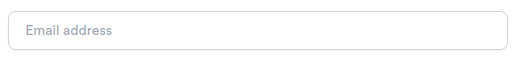
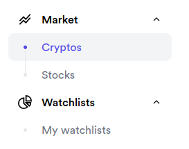
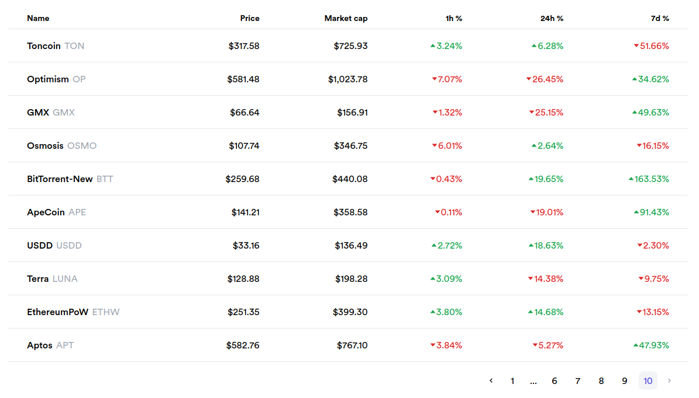
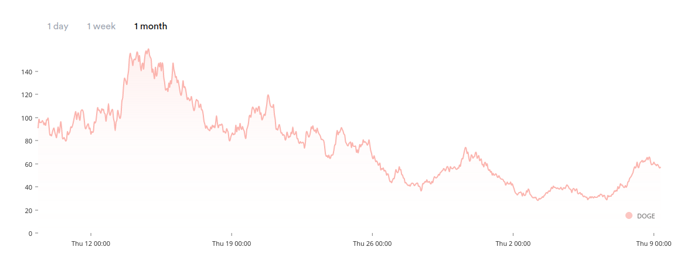
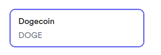

Stocks Seer
===========

Indice
======

* [Cliente](#cliente)
* [Servidor](#servidor)
* [Generador de datos](#generador-de-datos)
* [Despliegue](#despliegue)

Cliente
=======

El cliente ha sido desarrollado usando las siguientes tecnologias:

* `typescript`
* `react`
* `tailwind`
* `vite`

Ademas cuenta con el uso de otras librerias como:

* `wretch` (ligero wrapper sobre `fetch` para hacer peticiones de forma declarativa)
* `zod` (validacion de esquemas)
* `react-query` (cacheo de peticiones)
* `react-hook-form` (gestion de formularios)
* `react-router-dom` (gestion de rutas en el lado del cliente)
* `nivo` (libreria de graficos escrita sobre D3 para React)
* `headless-ui` (colleccion de componentes sin estilos)
* `vitest` (para testear)

La arquitectura esta basada en el siguiente repositorio: [bulletproof-react](https://github.com/alan2207/bulletproof-react)

Componentes y estilos
---------------------

La aplicacion sigue un estilo simple, limpio y moderno, usando el color indigo como color principal.

A continuacion se muestran los componentes principales.

### Input

#### Normal

#### Focus

### Boton

#### Primario

#### Primario deshabilitado

#### Secundario

### Barra de navegacion

### Tablas

### Chips

### Grafica

### Tarjetas

Gestion de peticiones
---------------------

Las peticiones se gestionan en dos capas (tres para las peticiones autentificadas):

* En primer lugar, disponemos de una capa inferior independiente de `react` y que se compone de llamadas mediante `wretch`. Por ejemplo, las llamadas que se encargan del login/registro/etc..., como se puede ver [aqui](https://github.com/krs98/stocks/blob/main/client/src/features/auth/api/index.ts)

* Para las peticiones que requieren de autentificacion hacemos uso de una funcion especial (la podemos encontrar [aqui](https://github.com/krs98/stocks/blob/main/client/src/lib/wretch.ts)) que dispone de un middleware para capturar las expiraciones del token de autentificacion, repetir la llamada, y redirigir al usuario en caso de no poder refescar el token. 

* Por ultimo, disponemos de una tercera capa que se encarga de cachear las peticiones realizadas por la primera o segunda capa. De esta forma, podemos mostrar informacion anterior mientras se realiza una nueva peticion, entre otros, y asi dar al usuario un experiencia mas fluida. Como ejemplo, tenemos los `hooks` que se encargan de obtener los stocks o acciones paginados ([aqui](https://github.com/krs98/stocks/blob/main/client/src/features/market/api/getPaginatedMarketAssets.ts)).

Rutas
-----

La aplicacion esta dividida en diferentes rutas que son gestionadas por un [router](https://reactrouter.com/en/main/start/overview) durante la ejecucion. Estas son:

* `/auth/login` 
* `/auth/register`
* `/market/cryptos`
* `/market/stocks`
* `/watchlists/my`
* `/watchlists/:id`

Las dos primeras rutas son publicas, mientras que el resto son privadas. En [este](https://github.com/krs98/stocks/blob/main/client/src/lib/auth.tsx) y [estos](https://github.com/krs98/stocks/tree/main/client/src/routes) archivos podemos ver la logica que se usa.

### `/auth/login`

Es la ruta mediante la cual un usuario puede acceder a su cuenta.

Tanto esta ruta como la siguiente disponen de una seccion en la cual se muestra una opinion escrita por un usuario (en realidad, usa la api de `openai` y el modelo `davinci` para generarla. Por eso tarda tanto. Para probarlo en local hara falta añadir el token apropiado a `.env`).

### `/auth/register`

ruta que usa un usuario para crear una cuenta.

### `/market/cryptos`

Muestra informacion de criptocurrencias en tiempo real. Es primera pagina que ve el usuario tras acceder a su cuenta. Tanto esta ruta como la siguiente disponen de cuadros de busqueda para filtrar en base al nombre/simbolo. Usamos un `debounce` para realizar las peticiones una vez el usuario ha dejado de escribir, y asi evitar saturar el servidor lanzando una peticion por cada tecla.

### `/market/stocks`

Muestra informacion de acciones en tiempo real.

### `/watchlists/my`

Muestra las listas creadas por el usuario.

Ademas, en la parte superior derecha podemos ver un boton que, al clickar, abre un `drawer` con un formulario para crear una nueva lista. Los datos necesarios para su creacion son: titulo, descripcion, cryptos, y acciones. Una vez creada el usuario sera redirigido a la ruta correspondiente a esa lista.

### `/watchlists/:id`

Muestra la lista indicada. Cuenta con dos secciones:

* la cabecera, en la cual se muestran el titulo y descripcion.
* el contenido, donde se muestra la grafica y las acciones en forma de tarjeta. Estas tarjetas pueden ser clickadas para activarlas/desactivarlas o arrastradas a la grafica para activarla. Por defecto, todas las tarjetas se encuentran activadas. Ademas, podemos seleccionar el periodo de tiempo que se mostrar en la  grafica (hay demasiados datos, y la grafica se renderiza usando svg para poder ser interactiva, asi que es bastante lenta).

Servidor
========

Para el servidor usamos `laravel` junto a `jwt-auth` para la gestion de tokens, ademas de una base de datos `postgres` (usamos esta en vez de `mysql` por temas de rendimiento, como se puede ver en la seccion sobre el generador de datos).

El token dispone de una duracion de 1 hora, y 1 dia de refresco. Una vez transcurrido el dia tras la generacion del token este pasara a ser completamente inutil: no se podra usar ni para refrescarlo, y el usuario debera pedir uno nuevo.

Todas las tablas y vistas son inicializadas por laravel, y se pueden ver [aqui](https://github.com/krs98/stocks/tree/main/server/database/migrations). Solo generamos un unico usuario de prueba (email: `test@gmail.com`, password: `test12`).

Rutas
-----

Disponemos de las siguientes rutas:

* `GET /auth/me`
* `POST /auth/login`
* `POST /auth/register`
* `POST /auth/refresh`
* `POST /auth/logout`
* `GET /market/cryptos`
* `GET /market/stocks`
* `GET /market/last-prices`
* `GET /cryptos/search`
* `GET /stocks/search`
* `GET /watchlists/my`
* `GET /watchlists/:id`
* `POST /watchlists`

Todas las rutas excepto `/auth/login`, `/auth/register` y `/auth/logout` son publicas.

### `GET /auth/me`

Devuelve la informacion del usuario, usando el token como identificador.

### `POST /auth/login`

Crea un nuevo token tras verificar las credenciales proporcionadas.

### `POST /auth/register`

Crea un nuevo usuario y devuelve un token.

### `POST /auth/refresh`

Refresca el token, invalidandolo y proporcionando uno nuevo.

### `POST /auth/logout`

Invalida el token.

### `GET /market/cryptos`

Retorna informacion actualizada y paginada de las criptocurrencias almacenadas.

### `GET /market/stocks`

Retorna informacion actualizada y paginada de las acciones almacenadas.

### `GET /market/last-prices`

Retorna las ultimos precios de los simbolos indicados, dentro del periodo proporcionado.

### `GET /cryptos/search`

Retorna una pagina con las criptocurrencias que coincidan con el termino de busqueda.

### `GET /stocks/search`

Retorna una pagina con las acciones que coincidad con el termino de busqueda.

### `GET /watchlists/my`

Retorna la lista paginada de watchlists del usuario.

### `GET /watchlist/:id`

Retorna la informacion de la watchlist indicada.

### `POST /watchlist`

Permite crear una watchlist.

Generador de datos
==================

Aunque solo se solicitaba almacenar 10 acciones, se tomado la decision de hacerlo mas desafiante. Este generador permite generar datos para hasta 2000 criptocurrencias y 2000 acciones, por minuto para un mes entero (asi que, 400.000.000 entradas). Por motivos practicas, solo se ha testeado con datos para 100 de cada (10.000.000 entradas), para cual tarda ~8s (a veces hasta ~5s).

Para lograr la mayor eficiencia razonablemente posible, usamos `rust` y `postgres`. La eleccion de `rust` es obvia. `postgres` nos permite mayor rendimiento que `mysql` y ademas disponemos de [vistas materializadas](https://www.postgresql.org/docs/current/rules-materializedviews.html), por lo que podemos ejecutar la query una vez (se refrescan por minuto) y almacenar su resultado).

El proceso inicial es simple. Por un lado:

* Realizamos una peticion a la api de [coinmarketcap](https://coinmarketcap.com/api/documentation/v1/#tag/cryptocurrency) para obtener la lista de criptocurrencias (quiza se podria haber almacenado en un csv y ahorrar un tiempo considerable).
* Generamos los datos para cada criptocurrencia, a demanda segun se van a insertar en la base de datos. Para una insercion eficiente usamos `bulk inserts`, teniendo en cuenta el limite de ~65000 parametros por query.
* Se refrescan las vistas materializadas.

Por otro lado:

* Leemos las acciones de un csv.
* Usamos el mismo proceso que el anterior para generar e insertar.

Ambas acciones occurren de forma concurrente en hilos separados, por lo que no tenemos que esperar a que uno termine para comenzar el siguiente.

Posteriormente, se activa un `cron` que se encarga insertar nuevos datos y de refrescar las vistas materializadas cada minuto.

En caso de querer ejecutar el programa, se recomienda hacerlo mediante `cargo run --release`. Ademas, se le puede pasar un parametro extra que indica el numero de acciones y criptocurrencias a insertart (ej: `cargo run --release 100` para insertar 100 de cada. Maximo son 2000).

Despliegue
==========
